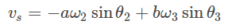
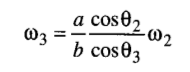

### Velocity Analysis

Let vs be the velocity of the slider, and ω3 be the angular velocity of the coupler link. Then, from the data obtained from the position analysis and the crank velocity, ω2, we have

**RELEVANT INDIAN STANDARD FOR IZOD IMPACT TEST**:

1. IS 1598:1977-Method for Izod impact test of metals
2. IS:3766-1977- Method for calibration of pendulum impact testing machines for testing metals

